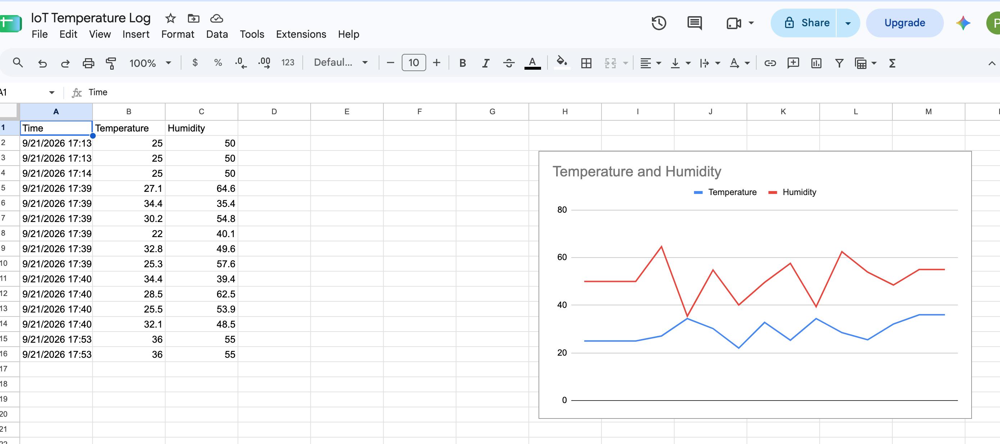
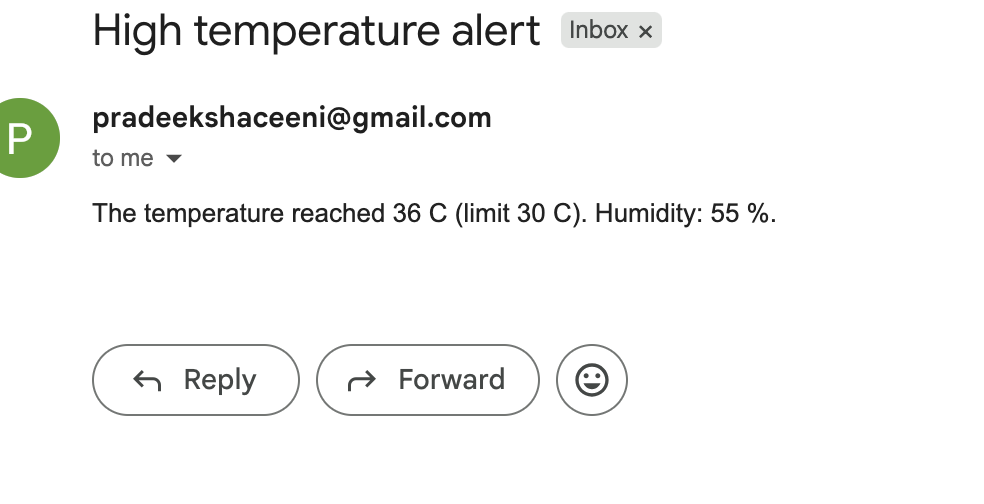

# IoT Temperature and Humidity Logger with Email Alerts

A small IoT project that logs temperature and humidity readings to a Google Sheet, draws a live chart, and sends an email alert when the temperature goes above a set limit.

## How it works
1. The sender (`sender.py`) sends a temperature and humidity reading to the Apps Script web app as a URL request.
2. The Apps Script (`Code.gs`) adds a new row to the Google Sheet with the time, temperature and humidity.
3. If the temperature is above the threshold, the script emails a **High temperature alert** to the owner of the script.
4. A cooldown stops the script from sending more than one alert every 10 minutes.

## Tech used

- Python (`requests`) running in Google Colab, used as the device simulator
- Google Apps Script (web app)
- Google Sheets (data log and chart)
- Gmail (through Apps Script `MailApp`)

## Files

| File | What it does |
| --- | --- |
| `Code.gs` | Apps Script that receives readings, logs them, and sends alerts |
| `sender.py` | Python code that sends readings to the web app |
| `images/` | Screenshots of the Sheet, chart and alert email |

## Settings

These are at the top of `Code.gs`:

| Setting | Value | Meaning |
| --- | --- | --- |
| `THRESHOLD` | `30` | An alert is sent when the temperature is above 30 C |
| `COOLDOWN_MS` | `10 * 60 * 1000` | At most one alert email every 10 minutes |

## Setup

1. **Create a Google Sheet.** In row 1 add the headers `Time`, `Temperature`, `Humidity`.
2. **Add the script.** In the Sheet, go to **Extensions > Apps Script**. Delete the default code and paste the contents of `Code.gs`. Click **Save**.
3. **Allow email access.** In the Apps Script editor, choose the `testEmail` function and click **Run**. Accept the permission prompts. You should receive an email titled **Test alert**.
4. **Deploy the web app.** Click **Deploy > New deployment**, choose the type **Web app**, set **Execute as** to *Me* and **Who has access** to *Anyone*, then click **Deploy**. Copy the web app URL that ends in `/exec`.
5. **Add your URL to the sender.** Open `sender.py` and replace `PASTE_YOUR_REAL_LINK_HERE` with your own `/exec` URL. Keep this URL private and never commit it to GitHub.
6. **Run the sender.** Run `sender.py` in Google Colab or on your computer. It should print `OK` for each reading.
7. **Add a chart.** In the Sheet, select the data, then choose **Insert > Chart** and pick a line chart for temperature and humidity.

If you change `Code.gs` later, click **Deploy > Manage deployments > Edit**, choose **New version**, and deploy again. The `/exec` URL stays the same.

## Demo

**Sheet with the temperature and humidity chart**

**High temperature alert email**

## Notes

- The `/exec` URL works like a password. Anyone who has it can add rows to your Sheet, so do not share it publicly.
- Readings with a temperature above 30 C trigger the alert, but only one email is sent every 10 minutes.
